# nf-core/gatkpopulation

> Population-scale germline short-variant calling with GATK4, BWA-MEM,
> NVIDIA Parabricks, and Nextflow.

[](https://www.nextflow.io/)
[](https://nf-co.re/)
[](https://docs.conda.io/)
[](https://www.docker.com/)
[](https://sylabs.io/docs/)
[](LICENSE)


`nf-core/gatkpopulation` processes single-end or paired-end FASTQ files through
read trimming, alignment, BAM preparation, per-sample GVCF calling,
GenomicsDBImport, joint genotyping, and VCF filtering. CPU and NVIDIA
Parabricks GPU paths produce compatible downstream inputs.

> [!IMPORTANT]
> This pipeline is under active development. Validate settings and outputs on
> representative test data before production analysis.

## Contents

- [Highlights](#highlights)
- [Workflow](#workflow)
- [Quick Start](#quick-start)
- [Configuration](#configuration)
- [Analysis Modes](#analysis-modes)
- [HPC Profiles](#hpc-profiles)
- [Stage Controls](#stage-controls)
- [Outputs](#outputs)
- [Resume Runs](#resume-runs)
- [Documentation](#documentation)
- [Citation](#citation)

## Highlights

- Required trimming with fastp or Trimmomatic, followed by FastQC
- CPU BWA-MEM/GATK4 and GPU Parabricks preprocessing paths
- WGS, WES, RAD/GBS/ddRAD, and amplicon sequencing modes
- Optional BQSR when indexed known-sites VCFs are available
- Per-sample GVCFs followed by per-contig GenomicsDBImport
- Whole-cohort or selected-sample joint genotyping
- Variant-only or all-sites VCF output
- Named BCFtools filtering presets plus custom filtering
- Optional GATK GatherVcfs before or after filtering
- Independent stage entry and stopping points from 0 through 6
- Slurm, SGE, UGE, PBS/Torque, and PBS Pro executor profiles
- Run-specific work and output roots with safe resume behavior
- MultiQC, software-version, trace, report, timeline, and DAG outputs

## Workflow

```mermaid
flowchart LR
    REF["Reference FASTA"] --> S0["0. Reference indexes"]
    FQ["FASTQ samples"] --> S1["1. Trim reads"]
    S1 --> QC["FastQC"]
    S1 --> S2{"2. BAM preprocessing"}
    S0 --> S2
    S2 --> CPU["CPU: BWA-MEM + GATK4"]
    S2 --> GPU["GPU: Parabricks"]
    CPU --> BAM["Final indexed BAM"]
    GPU --> BAM
    BAM --> S3["3. Per-sample GVCF"]
    S3 --> S4["4. GenomicsDB per contig"]
    S4 --> SUB{"Subset samples?"}
    SUB -->|No| S5["5. GenotypeGVCFs"]
    SUB -->|Yes| SELECT["SelectVariants"]
    SELECT --> S5
    S5 --> RAW["Per-contig raw VCF"]
    RAW --> G5{"Gather after stage 5?"}
    G5 -->|Yes| ALLRAW["all.raw.vcf.gz"]
    G5 -->|No| S6["6. BCFtools filtering"]
    ALLRAW --> S6
    S6 --> FILTERED["Filtered VCF"]
    FILTERED --> G6{"Gather after stage 6?"}
    G6 -->|Yes| ALLFILTERED["all.filtered.vcf.gz"]
```



| Stage | Operation | Main tools |
|------:|-----------|------------|
| 0 | Reference indexes and dictionary | BWA, SAMtools, GATK4 |
| 1 | Trimming and post-trimming QC | fastp/Trimmomatic, FastQC |
| 2 | Alignment, sorting, optional duplicate marking/BQSR, BAM statistics | BWA-MEM/GATK4 or Parabricks, SAMtools |
| 3 | Per-sample indexed GVCF | GATK4 or Parabricks |
| 4 | Per-contig all-sample database | GATK4 GenomicsDBImport |
| 5 | Per-contig joint genotyping | GATK4 GenotypeGVCFs |
| 6 | VCF filtering | BCFtools |

## Quick Start

### 1. Extract

```bash
tar -xzf nf-core-gatkpopulation.tar.gz
cd nf-core-gatkpopulation
```

### 2. Prepare configuration

```bash
cp assets/analysis.template.yml analysis.yml
cp assets/resources.template.config resources.config
```

Edit `analysis.yml` with absolute input and reference paths. Resource overrides
in `resources.config` are optional.

### 3. Create the FASTQ manifest

```csv
sample,fastq_1,fastq_2
T01,/data/T01_R1.fastq.gz,/data/T01_R2.fastq.gz
T02,/data/T02_R1.fastq.gz,/data/T02_R2.fastq.gz
```

Sample IDs must be unique. Leave `fastq_2` empty for single-end data.

### 4. Run

```bash
./run_pipeline.sh \
  -profile slurm,conda \
  -params-file analysis.yml \
  -c resources.config \
  -work-dir /data/work/gatkpopulation \
  --outdir /data/results/gatkpopulation
```

Print the complete command-line reference without creating a run:

```bash
./run_pipeline.sh --help
```

## Configuration

Keep analysis choices and infrastructure resources separate:

| File | Purpose | Loaded with |
|------|---------|-------------|
| [`assets/analysis.template.yml`](assets/analysis.template.yml) | Analysis and scheduler parameters | `-params-file analysis.yml` |
| [`assets/resources.template.config`](assets/resources.template.config) | Per-process CPUs, memory, time, and optional queues | `-c resources.config` |

Keep `-profile`, `-work-dir`, and the launcher base `--outdir` on the command
line. Do not place pipeline parameters in the resource config.

<details>
<summary><strong>Minimal analysis.yml example</strong></summary>

```yaml
input: /data/samplesheet.csv
fasta: /data/reference.fasta

sequencing_type: wgs
trimmer: fastp
known_sites: []

all_sites: false
filter_vcf: biallele
gather_vcfs: 5
```

</details>

<details>
<summary><strong>Per-process resource example</strong></summary>

```groovy
process {
    withName: BWA_MEM {
        cpus   = 16
        memory = 32.GB
        time   = 12.h
    }

    withName: GATK4_HAPLOTYPECALLER {
        cpus   = 8
        memory = 24.GB
        time   = 24.h
    }
}
```

</details>

## Analysis Modes

### Sequencing type

WGS is the default. WGS and WES mark duplicates; representative-sequencing
modes retain duplicates.

| Value | Shortcut | Duplicate marking | Final BAM |
|-------|----------|-------------------|-----------|
| `wgs` | `--wgs` | Enabled | `${sample}_aln_sort_MD.bam` |
| `wes` | `--wes` | Enabled | `${sample}_aln_sort_MD.bam` |
| `rad` | `--rad` | Disabled | `${sample}_aln_sort.bam` |
| `amp` | `--amp` | Disabled | `${sample}_aln_sort.bam` |

`rad` covers RAD-seq, GBS, ddRAD, and related reduced-representation
libraries. `amp` covers amplicon sequencing. CPU representative-sequencing
runs skip GATK MarkDuplicates and index the sorted BAM with SAMtools; GPU runs
add `pbrun fq2bam --no-markdups`.

```bash
./run_pipeline.sh --rad ...
```

### CPU and GPU

CPU is selected unless the `gpu` profile is present.

```bash
# CPU
-profile slurm,conda

# GPU with a local Parabricks SIF
-profile slurm,singularity,gpu \
--parabricks_sif /software/parabricks.sif

# GPU with Docker
-profile slurm,docker,gpu
```

Parabricks FQ2BAM uses `--low-memory` and four GPUs by default. Change this
with `--gpu_count N`. GPU fallback is enabled by default for BAM preprocessing
and per-sample GVCF calling. Stages 4-6 use CPU GATK4 or BCFtools.

### BQSR

BQSR runs only when known-sites VCFs are provided:

```yaml
known_sites:
  - /data/dbsnp.vcf.gz
  - /data/Mills_and_1000G.vcf.gz
```

Every `.vcf.gz` requires an adjacent `.vcf.gz.tbi`. Without known sites, BQSR
is skipped in both CPU and GPU paths.

### Sample subsets

Create a one-column CSV:

```csv
sample
T01
T02
```

Then use:

```bash
--subset_samples subset_samples.csv
```

GATK SelectVariants writes `${contig}.subset.g.vcf.gz` under `05.1-subset/`,
then GenotypeGVCFs writes the standard raw VCF name. The source GenomicsDB is
not modified.

### All-sites and filtering

Regular variant-only VCFs are the default. Add `--all_sites` to produce
`${contig}.all_sites.raw.vcf.gz`.

| Preset | Behavior |
|--------|----------|
| `--filter_vcf biallele` | Default: quality-filtered biallelic SNPs |
| `--filter_vcf monobi` | Monomorphic sites plus quality-filtered biallelic SNPs; indels removed |

Use `monobi` with `--all_sites` unless stage-6 inputs already contain
monomorphic records. `--bcftools_view_args` overrides either preset.

### Gathering VCFs

```bash
# Gather raw contig VCFs, then filter only the gathered VCF.
--gather_vcfs 5

# Filter each contig, then gather the filtered VCFs.
--gather_vcfs 6
```

Stage-5 gathering always publishes `05-raw_vcf/all.raw.vcf.gz`. Both modes can
produce `06-filtered_vcf/all.filtered.vcf.gz`. Per-contig published files are
retained.

## HPC Profiles

Use exactly one scheduler profile and one software profile:

| Scheduler | Profile | Common parameters |
|-----------|---------|-------------------|
| Slurm | `slurm` | `slurm_queue`, `slurm_account`, `slurm_qos` |
| Sun/Open Grid Engine | `sge` | `sge_queue`, `sge_project`, `sge_penv` |
| Univa Grid Engine | `uge` | `uge_queue`, `uge_project`, `uge_penv` |
| PBS/Torque | `pbs` | `pbs_queue`, `pbs_account` |
| PBS Pro | `pbspro` | `pbspro_queue`, `pbspro_account` |

```bash
-profile slurm,conda
-profile sge,singularity
-profile uge,conda
-profile pbs,conda
-profile pbspro,singularity
```

All grid executors require input and work paths visible from compute nodes.
SGE/UGE/PBS-family GPU resource syntax is site-specific; use the corresponding
`*_gpu_cluster_options` parameter. `{gpu_count}` is replaced with the value of
`--gpu_count`.

<details>
<summary><strong>Scheduler examples</strong></summary>

```bash
# SGE
./run_pipeline.sh \
  -profile sge,conda \
  --sge_queue all.q \
  --sge_project PROJECT \
  --sge_penv smp \
  ...

# Univa Grid Engine
./run_pipeline.sh \
  -profile uge,conda \
  --uge_queue all.q \
  --uge_project PROJECT \
  --uge_penv smp \
  ...

# PBS/Torque
./run_pipeline.sh \
  -profile pbs,conda \
  --pbs_queue batch \
  --pbs_account PROJECT \
  ...

# PBS Pro
./run_pipeline.sh \
  -profile pbspro,conda \
  --pbspro_queue workq \
  --pbspro_account PROJECT \
  ...
```

</details>

## Stage Controls

Use `--start_stage` and `--stop_stage` with values from 0 through 6. The
default range is 0-6.

| Start stage | Required `--input` CSV columns |
|------------:|--------------------------------|
| 0-2 | `sample,fastq_1,fastq_2` |
| 3 | `sample,bam,bai` |
| 4 | `sample,gvcf,tbi` |
| 5 | `contig,genomicsdb` |
| 6 | `contig,vcf,tbi` |

```bash
# Build GenomicsDB from existing sample GVCFs.
./run_pipeline.sh \
  --start_stage 4 \
  --stop_stage 4 \
  --input stage4_gvcfs.csv \
  --fasta /data/reference.fasta \
  --fasta_fai /data/reference.fasta.fai \
  --fasta_dict /data/reference.dict \
  ...
```

Starting after stage 0 and running stages 2-5 requires existing FASTA `.fai`
and `.dict` companions. Starting at stage 1 or 2 and running stage 2 also
requires `--bwa_index`. Stage-6 gathering requires `--fasta_fai` when starting
directly at stage 6.

## Outputs

For serial `K8Z2`, the launcher creates a result root such as
`/data/results/gatkpopulation_K8Z2`:

```text
gatkpopulation_K8Z2/
├── 00-ref_gatk4/
├── 01-fq_trim/
├── 02-bam/
├── 03-sample_gvcf/
├── 04-genomicsDB/
├── 05.1-subset/       # Optional
├── 05-raw_vcf/
├── 06-filtered_vcf/
├── multiqc/
└── pipeline_info/
```

| Directory | Principal outputs |
|-----------|-------------------|
| `00-ref_gatk4/` | FASTA index, dictionary, BWA index |
| `01-fq_trim/` | Trimmed FASTQs and trimming/FastQC reports |
| `02-bam/` | Final BAM/index, optional BQSR/duplicate metrics, SAMtools stats |
| `03-sample_gvcf/` | Per-sample GVCF and index |
| `04-genomicsDB/` | Per-contig GenomicsDB workspaces |
| `05.1-subset/` | Optional selected-sample GVCFs |
| `05-raw_vcf/` | Raw per-contig or gathered VCF |
| `06-filtered_vcf/` | Filtered per-contig or gathered VCF |
| `multiqc/` | MultiQC report and data |
| `pipeline_info/` | Parameters, versions, report, trace, timeline, and DAG |

See [output documentation](docs/output.md) for details.

## Resume Runs

`run_pipeline.sh` appends a four-character serial to the base work and output
paths. The first character is A-Z; the remaining characters are A-Z or 0-9.

```text
/data/work/gatkpopulation_K8Z2
/data/results/gatkpopulation_K8Z2
```

Resume by run name:

```bash
./run_pipeline.sh \
  -resume gatkpopulation_K8Z2 \
  -profile slurm,conda \
  -work-dir /data/work/gatkpopulation \
  --outdir /data/results/gatkpopulation
```

The launcher recovers the serial from its run marker and stores
`nextflow.log` in the serial-specific work directory.

## Documentation

- Command-line reference: run `./run_pipeline.sh --help`
- [Usage guide](docs/usage.md)
- [Output reference](docs/output.md)
- [Analysis parameter template](assets/analysis.template.yml)
- [Resource configuration template](assets/resources.template.config)
- [Tool citations](CITATIONS.md)
- [Contributing guide](docs/CONTRIBUTING.md)

## Citation

Tool references are listed in [`CITATIONS.md`](CITATIONS.md).

This pipeline uses infrastructure developed and maintained by the
[nf-core](https://nf-co.re) community:

> Ewels PA, Peltzer A, Fillinger S, Patel H, Alneberg J, Wilm A, Garcia MU,
> Di Tommaso P, Nahnsen S. The nf-core framework for community-curated
> bioinformatics pipelines. _Nature Biotechnology_ 38, 276-278 (2020).
> [doi:10.1038/s41587-020-0439-x](https://doi.org/10.1038/s41587-020-0439-x)

## License

Copyright (c) 2026 Chih-Cheng Chien and Research Center of Genetic Resources,
NARO, Japan.

This project is released under the MIT License. The license permits use,
copying, modification, distribution, sublicensing, and sale, provided that the
copyright and permission notices are retained. The software is provided
without warranty.

See [`LICENSE`](LICENSE) for the complete legal terms.

## Authors

`nf-core/gatkpopulation` was originally written by Chih-Cheng Chien.
